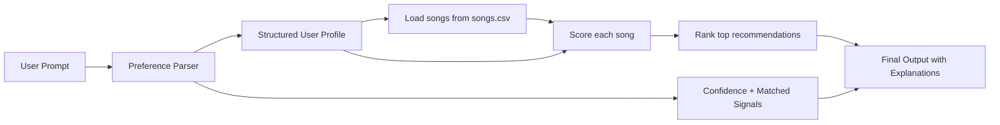

# 🎧 TuneTailor AI: Natural Language Playlist Assistant

## Project Summary

**Original base project:** Music Recommender Simulation

This project extends my earlier **Music Recommender Simulation** into a more complete applied AI system. The original version used a structured user taste profile to score songs based on features like genre, mood, energy, and acousticness, then ranked the songs from highest to lowest. In this final version, I redesigned the system so that it can accept **natural language music requests**, infer user preferences from those prompts, and generate recommendations with explanations and confidence scoring.

TuneTailor AI is a lightweight, explainable music recommendation system that turns user requests like *"I want calm acoustic music for studying"* into structured preferences. It then retrieves songs from a dataset, scores them against the inferred profile, ranks the best matches, and explains why each song was recommended. The goal is to show how an AI system can combine input interpretation, recommendation logic, and reliability features in a way that is both functional and transparent.

---

## Why This Project Matters

Many recommendation systems feel intelligent because they translate vague human requests into actionable decisions. This project demonstrates that idea in a simple, explainable way. Rather than relying on opaque black-box behavior, TuneTailor AI makes its reasoning visible through:

- natural-language preference parsing
- interpretable scoring logic
- recommendation explanations
- confidence scoring
- automated tests for reliability

This makes the project both a functional recommender and a small example of responsible AI system design.

---

## AI Feature

This project includes two meaningful AI-oriented upgrades integrated into the main application flow:

### 1. Specialized Input Interpretation

Instead of requiring a manually written user profile, the system parses natural-language prompts and maps them into structured user preferences such as:

- preferred genre
- preferred mood
- target energy
- acoustic preference

For example:

- `"Give me happy upbeat songs for a fun drive"`
- `"I want calm acoustic music for studying"`
- `"Recommend chill rainy day songs"`

are converted into profiles the recommendation engine can use directly.

### 2. Reliability and Testing

The system includes reliability features to make behavior easier to evaluate:

- confidence scoring based on how many signals were detected in the prompt
- matched-signal reporting so users can see what influenced the inference
- automated tests for both the parser and recommender logic

These features are part of the main system behavior, not standalone extras.

---

## System Architecture

TuneTailor AI follows a simple modular pipeline:

1. **User Prompt**  
   The user enters a natural-language music request.

2. **Preference Parser**  
   The parser identifies keywords and maps them into structured preferences.

3. **Structured User Profile**  
   The parsed result is converted into a dictionary containing genre, mood, energy, and acoustic preference.

4. **Song Retrieval**  
   The system loads song data from `data/songs.csv`.

5. **Scoring and Ranking Engine**  
   Each song is scored against the user profile using weighted matching logic.

6. **Explanation + Confidence Output**  
   The system returns top recommendations, explanations, confidence, and matched signals.

### Data Flow


## Setup Instructions

### 1. Clone the repository

```bash
git clone https://github.com/katrinavan/applied-ai-system-project.git
cd applied-ai-system-project
```
### 2. Create and activate a virtual environment
```bash
python3 -m venv .venv
source .venv/bin/activate
```
### 3. Install dependencies
```bash
pip install -r requirements.txt
```
### 4. Run the system
```bash
python3 -m src.main
```
### 5. Run tests
```bash
pytest
```
## Sample Interactions

### Example 1

**Input:**  
`Give me happy upbeat songs for a fun drive`

**Parsed preferences:**  
`{'genre': 'pop', 'mood': 'happy', 'energy': 0.75, 'likes_acoustic': False}`

**System output highlights:**  
- confidence: `0.50`
- matched signals: `['happy/upbeat']`

**Top recommendation:**  
**Sunrise City**  
Recommended because it matches your preferred genre of pop, it fits the happy mood you asked for, is very close to your target energy, and fits your preference for less acoustic songs.

### Example 2

**Input:**  
`I want calm acoustic music for studying`

**Parsed preferences:**  
`{'genre': 'lofi', 'mood': 'chill', 'energy': 0.3, 'likes_acoustic': True}`

**System output highlights:**  
- confidence: `1.00`
- matched signals: `['study/focus/lofi', 'chill/calm/rain', 'acoustic']`

**Top recommendation:**  
**Library Rain**  
Recommended because it matches your preferred genre of lofi, it fits the chill mood you asked for, is very close to your target energy, and strongly matches your acoustic preference.

### Example 3

**Input:**  
`Recommend chill rainy day songs`

**Parsed preferences:**  
`{'genre': 'pop', 'mood': 'chill', 'energy': 0.4, 'likes_acoustic': True}`

**System output highlights:**  
- confidence: `0.50`
- matched signals: `['chill/calm/rain']`

**Top recommendation:**  
**Library Rain**  
Recommended because it fits the chill mood you asked for, is very close to your target energy, and strongly matches your acoustic preference.

## How the Recommendation Logic Works

This system uses a **content-based recommendation approach**, meaning it compares the inferred user preferences directly to the features of each song in the dataset. Rather than relying on listening history or collaborative filtering, it scores songs based on how well they match the user’s requested vibe.

### Features Used

**Song features**
- genre
- mood
- energy
- acousticness

**User preference features**
- genre
- mood
- target energy
- likes acoustic

### Scoring Logic

For each song, the system:

- adds **+2.0 points** if the genre matches the user’s preferred genre
- adds **+1.5 points** if the mood matches the user’s preferred mood
- adds up to **+2.0 points** based on how close the song’s energy is to the user’s target energy
- adds up to **+1.0 point** depending on whether the song matches the user’s acoustic preference

After scoring all songs, the system sorts them from highest to lowest and returns the top recommendations. This makes the recommendation process easy to interpret, explain, and debug.
## Design Decisions

### Why I used rule-based parsing

I chose a rule-based parser instead of using an external LLM or API because it is easier to test, explain, and run reproducibly. Since this project is meant to show how the system makes decisions, a simple keyword-based approach made the behavior more transparent and easier to debug.

### Why I kept content-based recommendation

A content-based recommender fit this project well because it compares the user’s inferred preferences directly to song features such as genre, mood, energy, and acousticness. This made the recommendation logic easier to understand and allowed the system to stay interpretable rather than relying on hidden behavior from a more complex model.

### Why I added confidence scoring

Natural-language inputs can be vague or incomplete, so I added confidence scoring to show how strongly the system understood a prompt. This makes the output more honest and helps users see when the recommender is making a stronger inference versus when it is relying more on default values.

### Why explanations matter

I added recommendation explanations so the system would be easier to trust and evaluate. Instead of only returning ranked songs, the recommender also explains which features influenced the result, which makes the system feel more transparent and more aligned with responsible AI design.

### Trade-offs I made

One major trade-off in this project was choosing simplicity and interpretability over complexity. A more advanced recommender could use richer language understanding, larger datasets, or collaborative filtering, but that would make the system harder to explain and test within the scope of this project. I chose a smaller, more transparent design so that the full decision-making process would remain visible and reproducible.

## Reliability and Testing Summary

This project includes automated tests for both recommendation behavior and prompt parsing.

### Current testing coverage

- parser correctly maps study-related prompts to lofi/chill preferences
- parser detects gym/workout prompts as high-energy
- parser detects happy/upbeat mood
- parser safely handles vague prompts using default values
- parser detects acoustic preference
- recommender functionality tests pass
- OOP recommender tests pass

### Result

`7 tests passed`

### What worked well

The parser performed best when the prompt included clear signals such as *study*, *acoustic*, *happy*, *upbeat*, or *gym*. In those cases, the inferred profile and final recommendations aligned well with the requested mood and energy.

### What did not work as well

The system is weaker on vague or ambiguous prompts. When the input lacks clear signals, it falls back to default values, which keeps the system usable but may not fully reflect the user’s actual preferences.

### Guardrails used

- default preference values for unclear prompts
- confidence scoring from `0.0` to `1.0`
- matched-signal reporting for transparency
- automated unit tests across multiple prompt types

## Limitations and Risks


This system still has several important limitations:

- it uses a small dataset, so recommendation diversity is limited
- it relies on hand-written parsing rules, which may miss more nuanced language
- it does not use listening history, collaborative filtering, artist relationships, or lyrics
- exact labels such as genre and mood can overly shape the final ranking
- scoring weights reflect human assumptions and may introduce bias into what gets recommended

Because of these limitations, this project should be understood as a transparent prototype rather than a production-grade recommender.

## Reflection

This project helps students understand the core idea that a recommender system works by turning user preferences and item features into scores, then ranking results based on those scores. One of the most important concepts students need to understand is that even a simple AI system can feel intelligent when it combines input interpretation, scoring logic, and clear output explanations. Students are most likely to struggle with tracing how each feature, such as genre, mood, energy, and acousticness, affects the final ranking and why some songs score higher than others. AI was helpful in speeding up brainstorming, drafting code structure, and suggesting ways to improve explanations and organization. At the same time, AI could be misleading when it suggested changes that sounded correct but did not fully match the project requirements or the existing code behavior. One way I would guide a student without giving away the answer is by asking them to manually compare two songs against one user profile and explain which one should score higher and why. That process helps students focus on the scoring logic step by step instead of guessing.
## Model Card

See [model_card.md](model_card.md) for a reflection on system behavior, design choices, limitations, testing, and AI collaboration.
## Demo Screenshots

Write 1 to 2 paragraphs here about what you learned:

- about how recommenders turn data into predictions
- about where bias or unfairness could show up in systems like this


---

---

## Instruction Summary

This project is mainly about helping students understand how a simple recommender system turns user preferences into ranked results.

### Key ideas students should understand
- The recommender uses a **content-based approach**, meaning it compares user preferences directly to song features.
- Songs are scored using a **weighted scoring system**.
- Higher scores come from stronger matches in features such as genre, mood, energy, and acousticness.
- After scoring, songs are **sorted from highest to lowest** and the top results are returned.

### Most important implementation pieces
- `load_songs()` reads the dataset and converts each row into usable song data.
- `recommend_songs()` scores every song and returns the top ranked results.
- `Recommender.recommend()` does the same idea in the OOP version used by the tests.
- `explain_recommendation()` gives a short explanation for why a song ranked well.

### Where students may struggle
- Understanding how the weighted scoring formula works
- Seeing why one feature can affect ranking more than another
- Tracing how user preferences change the final output
- Understanding why exact genre or mood matches can dominate results

### What to emphasize when guiding students
- Focus on the idea that the recommender is just **assigning points and sorting**
- Encourage students to manually reason through why one song should rank above another
- Have students test at least two user profiles and compare the results
- Remind students that recommendation systems can still show bias even when the code is simple

### Common limitations to discuss
- The dataset is small, so recommendations are limited
- The system does not use listening history, lyrics, or artist similarity
- Exact category matching may reduce recommendation diversity
- Weight choices strongly affect outcomes


